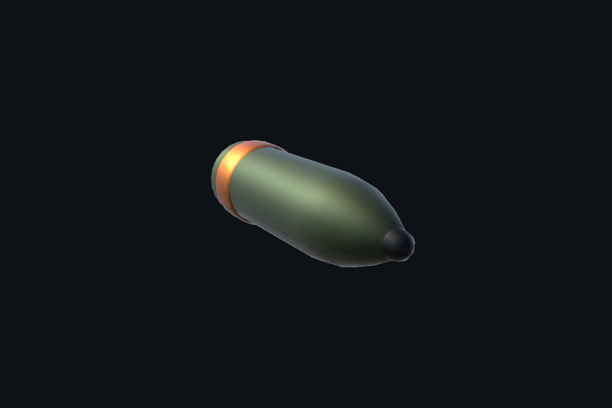
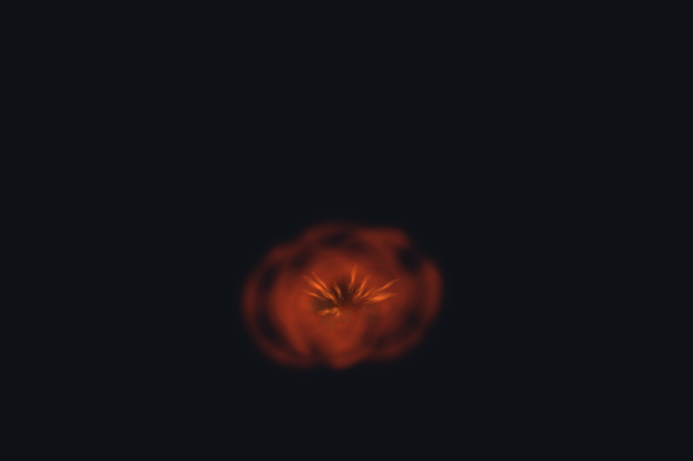
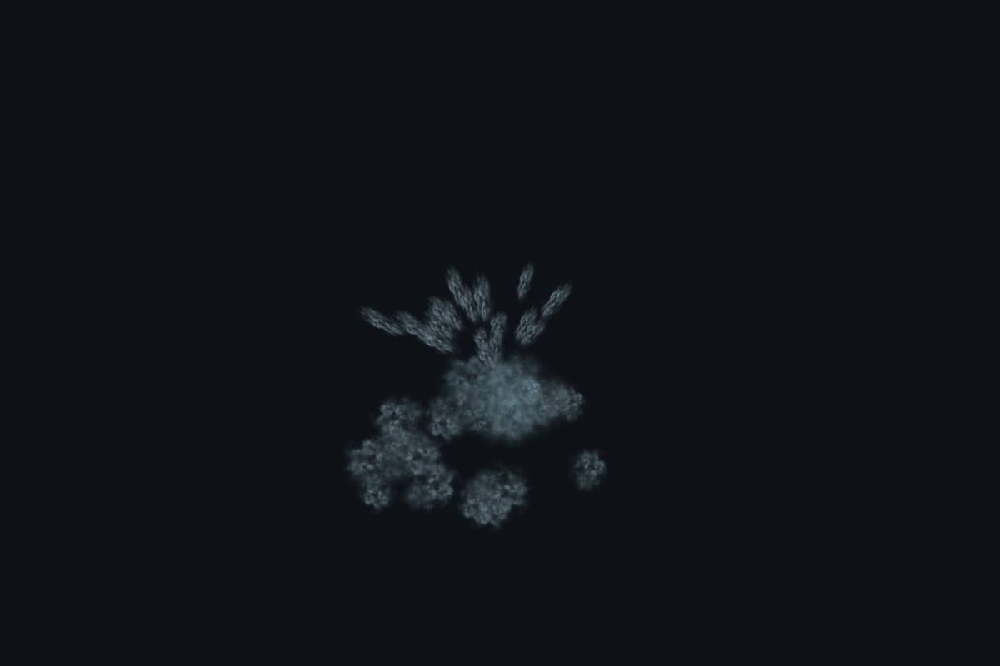

# 상륙 장면용 곡사 포탄 사용 안내

완료일: 2026-09-26. Unity 6000.0.55f1 / URP 17.0.4 기준.

카메라 연습에 사용할 **반복 가능한 사건**을 준비했다. 포탄이 지정한 출발점에서 곡선을 그리며 날아와 지면 또는 수면에 착탄한다. 카메라 컷, 흔들림, Volume, 캐릭터 피격 연기는 사용자가 결정한다.

## 1. 우선 별도 테스트 씬에서 확인하기

1. 지금 작업하던 씬과 Timeline을 평소 방식으로 저장한다.
2. Project 창에서 `Assets/IncheonArtillery/Demo/Artillery_Practice.unity`를 더블클릭한다.
3. **Play**를 누른다. 왼쪽 땅에는 불꽃·흙먼지·연기, 오른쪽 물에는 물보라가 반복해서 발생한다. 첫 착탄까지는 약 3~4초 기다린다.
4. Hierarchy에서 `Ground_Barrage` 또는 `Water_Barrage`를 선택한다. Inspector 맨 아래의 **포탄 한 발 발사**, **설정한 수만큼 일제 사격**, **자동 포격 시작/중지** 버튼으로 동작을 확인한다.
5. Play를 끈 뒤 원래 작업하던 `Incheon_Practice` 씬을 다시 연다. Play 중 변경한 값은 보통 종료하면 되돌아가므로, 마음에 든 값은 기억해 두었다가 편집 모드에서 입력한다.

이 테스트 씬의 카메라와 조명은 테스트 전용이다. 본편 씬에는 새 카메라나 자동 포격을 배치하지 않았다.

## 2. 본편 씬에 포탄 하나 배치하기

1. Project 창의 `Assets/IncheonArtillery/Prefabs/Artillery_Barrage.prefab`을 **Hierarchy로 드래그**한다. 이것이 발사 기능까지 연결된 프리팹이다.
2. 새 `Artillery_Barrage`를 펼치면 `LaunchPoint`와 `ImpactTarget`이 보인다. 상위 오브젝트의 Scale은 `(1, 1, 1)`을 유지한다.
3. **LaunchPoint**를 선택하고 이동 도구(W)로 포탄이 날아오기 시작할 하늘 쪽에 놓는다. 실제 포대가 없어도 화면 밖에 두면 된다. Transform의 회전이 아니라 두 지점의 위치로 궤적을 정한다.
4. **ImpactTarget**을 선택해 포탄이 떨어질 해변에 놓는다. 처음에는 캐릭터에서 떨어진 눈에 잘 보이는 곳으로 정한다.
5. 상위 **Artillery_Barrage**를 선택한다. `Scatter Radius = 0`으로 바꾸면 매번 정확히 같은 목표점에 떨어져 비교하기 쉽다. `Automatic Fire`가 켜져 있는지 확인하고 Play한다.
6. 카메라 화면에서 포탄과 착탄을 확인한다. 한 발씩 보고 싶으면 `Automatic Fire`를 끄고 Play 중 Inspector 하단의 **포탄 한 발 발사** 버튼을 누른다.

포탄의 이동은 **Play 모드에서 실행**된다. 편집 모드의 Timeline 재생 헤드를 움직이는 것만으로 비행이 미리 재생되지는 않는다. Scene 창에서 Gizmos를 켜고 상위 오브젝트를 선택하면 예상 곡선과 착탄 반경을 볼 수 있다. 곡선 가이드는 목표점 기준이며 지형 보정·중간 충돌에 따라 실제 착탄점은 달라질 수 있다.

## 3. 먼저 조절할 값

| Inspector 항목 | 바뀌는 화면 | 처음 비교할 값 |
| --- | --- | --- |
| Flight Time | 목표까지 날아가는 시간. 클수록 천천히 날아온다. 중간에 부딪히면 먼저 터진다. | 기본 2.2초 → 3초 |
| Arc Height | 출발점과 목표를 잇는 직선보다 위로 솟는 양 | 기본 10 → 15 |
| Scatter Radius | 목표 주변 착탄 위치가 흩어지는 반경 | 처음 0, 넓은 포격은 3~6 |
| Start Delay | Play/활성화 후 첫 자동 발사까지 대기 | 기본 1초 |
| Fire Interval | 자동 일제 사격 간격 | 기본 1.2초 |
| Shells Per Volley | 한 번에 쏘는 발수 | 기본 1, 포격은 3~4부터 |
| Random Seed | 착탄 위치의 난수 순서를 재현하는 값 | 기본 1950 유지 |

첫 연습은 **한 발 / 산포 0 / 비행 3초**로 시작하면 좋다. 같은 포탄을 FS, POV, ELS에서 각각 관찰하고, 그 다음 발수나 산포를 늘린다. Random Seed가 같아도 발사 시점·배치·지형이 달라지면 화면은 달라진다.

## 4. 해변과 바다에 떨어뜨리기

**해변:** `Snap Target To Ground`를 켜고 `Ground Mask`에 **Ground**를 둔다. Terrain이나 지면에는 Collider와 Ground 레이어가 있어야 한다. 현재 프로젝트는 Ground가 레이어 3이다. 목표점 위 100m에서 아래 300m 범위 안의 지면 높이를 찾는다.

**바다:** `Use Water Plane`을 켜고 `Water Level`을 실제 수면의 월드 Y 높이로 맞춘다. 현재 기본값은 **0**이다. `ImpactTarget`을 바다 쪽으로 옮기고 Y를 수면 높이로 둔다. 수면 Collider 없이도 수면에서 물보라를 발생시키며, 수면 아래 해저까지 내려가지 않는다.

수면은 무한한 수평면으로 가정한다. 같은 높이보다 낮은 육지도 수면으로 판정될 수 있다. 그런 장소에서는 해당 발사기의 `Use Water Plane`을 끈다. 파도 모양이나 해안선의 물 영역을 정밀하게 추적하는 기능은 아니다.

`Collision Mask`는 비행 중 부딪힐 대상을 정한다. 기본값은 Ignore Raycast·Water·UI를 제외한다. 발사점을 배나 캐릭터 Collider 안에 놓지 말고 조금 띄운다. 부딪혔다는 사실만으로 캐릭터가 쓰러지지는 않는다.

## 5. 여러 군데에서 반복 포격하기

1. 잘 동작하는 `Artillery_Barrage`를 Ctrl+D로 복제한다.
2. 새 발사기의 `LaunchPoint`와 `ImpactTarget`을 이동한다.
3. `Start Delay`와 `Random Seed`를 서로 다르게 주면 같은 순간·같은 배치가 겹치는 것을 줄일 수 있다.
4. 촘촘한 포격은 `Fire Interval`을 줄이거나 `Shells Per Volley`를 늘린다.

`Pool Size`는 **발사기 하나가 미리 준비하는 포탄 수**다. 기본 16개이고, 발사 → 착탄 효과 → 회수가 끝난 포탄을 다시 쓴다. 효과는 기본 약 3.6초 뒤 회수된다. 한도가 차면 새 오브젝트를 계속 만들지 않고 해당 발사를 생략한다. Inspector 하단에서 사용 중인 수와 생략 수를 확인할 수 있다.

대략 필요한 수는 `한 번에 쏘는 수 × (비행 시간 + 3.6초) ÷ 발사 간격`에 여유분을 더해 생각하면 된다. 예를 들어 4발을 1.2초마다 쏘고 비행이 2.2초라면 24개 정도부터 확인한다. Pool Size는 **Play 전에** 설정한다. 여러 발사기의 풀 크기는 합산되므로 처음부터 모두 96으로 올릴 필요는 없다.

## 6. 원하는 Timeline 시점에 발사하기

이 부분은 사용자가 연출을 정한 뒤 직접 연결하는 단계다. 기존 Timeline에는 연결을 추가하지 않았다.

1. 발사기의 `Automatic Fire`를 끈다.
2. 발사기 오브젝트에 **Signal Receiver** 컴포넌트를 추가한다.
3. 사용하려는 Timeline에 **Signal Track**을 추가하고, 그 트랙의 바인딩에 발사기 오브젝트를 연결한다.
4. 원하는 **발사 시점**에 Signal Emitter를 만들고 새 Signal Asset을 지정한다. 새 Signal 파일은 `Assets/IncheonArtillery/Signals`처럼 따로 만든 폴더에 보관해도 된다.
5. Signal Receiver에 같은 Signal의 반응을 추가한다. 반응 이벤트의 대상에 발사기 오브젝트를 넣고 **ArtilleryBarrage → Fire()**를 선택한다. 여러 발을 한 번에 쏘려면 **FireVolley()**를 고른다.
6. Play에서 Timeline을 재생해 확인한다. Timeline이 반복될 때도 발사하려면 Signal의 Emit Once 설정도 확인한다.

**착탄 시점 = 발사 시점 + Flight Time**을 기준으로 잡는다. 예를 들어 10초에 착탄시키고 비행이 2.2초라면 7.8초에 발사한다. 중간 Collider에 닿으면 더 일찍 터질 수 있다. StopBarrage()는 자동 발사를 중지하고, 이미 날아간 포탄은 계속 진행한다. StopAllShells()는 현재 비행과 착탄 효과를 즉시 정리한다.

이 포탄은 게임 시간(Time.deltaTime)을 따라간다. Timeline 정지/역재생/스크러빙과 비행 시간이 자동으로 동기화되지는 않는다. 반복 촬영은 Play를 다시 시작하는 방식이 가장 간단하다.

착탄 순간 다른 연출을 연결할 때는 `On Impact` 이벤트를 사용할 수 있다. 카메라 흔들림, 소리, 캐릭터 피격·사망은 이번 프리팹에 자동 연결하지 않았다.

## 7. 파일 구성과 재료

| 위치 | 용도 |
| --- | --- |
| `Assets/IncheonArtillery/Prefabs/Artillery_Barrage.prefab` | 씬에 배치할 발사기. 출발점·목표점·재사용 풀 포함 |
| `Assets/IncheonArtillery/Prefabs/Shell_Projectile.prefab` | 발사기가 내부적으로 사용하는 포탄·궤적·착탄 효과 |
| `Assets/IncheonArtillery/Prefabs/Shell_Model.prefab` | 소품으로도 배치할 수 있는 외형만의 프리팹 |
| `Assets/IncheonArtillery/Demo/Artillery_Practice.unity` | 지상/수면 비교용 별도 테스트 씬 |
| `Assets/IncheonArtillery/Materials` | 포탄 금속, 흙먼지, 불꽃, 물보라 재질 |

포탄 모델은 이번 작업에서 생성한 단순 메시다. 효과 텍스처는 이미 다운로드한 **Kenney Particle Pack(CC0)**의 smoke_01/light_01을 사용했다. 라이선스는 `Assets/IncheonArtillery/Textures/Kenney-License.txt`에 보관했다. 추가 유료 에셋이나 패키지는 필요 없다. 데모의 물은 기존 `Coastal_Water.mat`를 참조한다.

## 8. 검증 범위

- Unity 에디터에서 실제 포탄 이동 코드를 고정 시간 간격으로 진행하는 검사를 수행했다. 본편 씬은 저장하거나 변경하지 않았다.
- 4개 풀의 한도 초과 발사 생략, 80회 추가 발사에서 동일 인스턴스 재사용, 중복 착탄 콜백 없음, 회수 시 궤적·파티클 초기화를 확인했다.
- 0.05초 고속 비행의 지면 충돌, 수면보다 아래 해저가 있어도 수면 착탄을 우선하는 동작을 확인했다.
- 프리팹 재질의 셰이더 오류를 검사하고, Unity 렌더로 포탄과 착탄 효과를 확인했다.
- 사용자가 편집 중인 Timeline을 보존하기 위해 본편의 Play/Timeline 연동 재생 검사는 수행하지 않았다. 실제 카메라 구도·노출에서의 크기와 밝기는 위 순서로 확인해 조절한다.
- 검사 메뉴: `Tools → Incheon Artillery → 3 Verify Pool Collision And Effects`. 결과: `Temp/artillery-verification.txt`.

